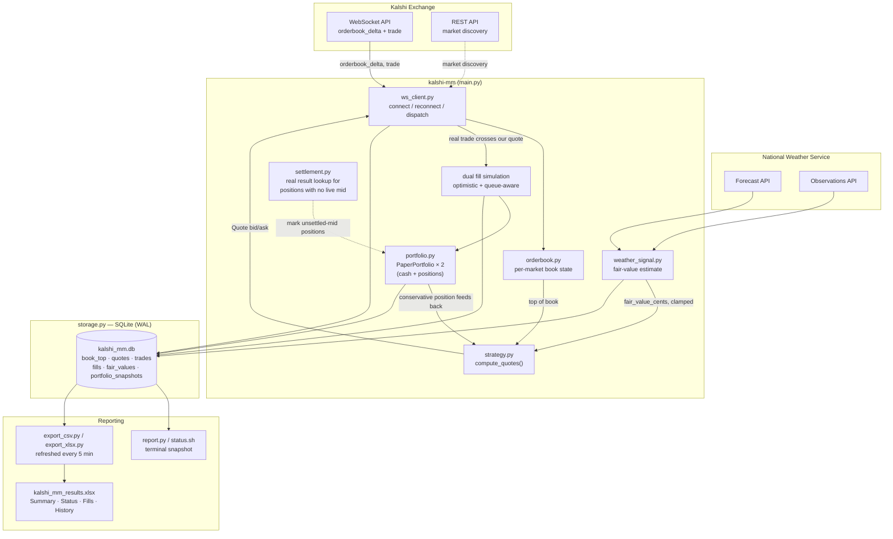

# Kalshi Market-Making

A market-making bot for [Kalshi](https://kalshi.com) prediction markets: daily high-temperature
bucket contracts (e.g. *"Will the high in NYC be 82-83° on Aug 2?"*) and near-term single-game sports
markets (MLB, NFL, WNBA, UCL). It connects to Kalshi's real market data over WebSocket, quotes a
spread around either the market midpoint or (for weather markets) its own fair-value estimate pulled
from NWS data, and tracks a cash/position ledger.

There are **two separate entry points**, deliberately kept apart so nothing about the paper bot can
accidentally touch a real order:

- **`main.py`** — paper trading. No real orders; fills are simulated against real trade prints.
- **`live_trader.py`** — real trading. Places, amends, and cancels real resting orders against a real
  Kalshi account via signed REST calls.

> **Status: real capital is live.** `live_trader.py` is currently running against a real Kalshi
> account, with real dollars, placing real orders. This started as a paper-trading project; that
> phase is done. See [Live trading: real capital](#live-trading-real-capital) for how the live path
> actually works and [Honesty / limitations](#honesty--limitations) for what's still missing before
> trusting it unattended. `main.py` (paper) is unaffected and still simulates everything — it never
> places an order regardless of what `live_trader.py` is doing.

## Why market making, and why these markets

Kalshi isn't a continuous market like an equity exchange — it's binary event contracts, and most
flagship markets (Fed decisions, elections, season-long championship/award futures) are dominated by
informed flow that eats naive market makers alive: thin day-to-day activity punctuated by violent
one-directional jumps on news. Daily weather-threshold contracts and single-game sports outcomes are
the opposite — high-volume, mostly retail-driven, resolve within a day or two (so any mispricing gets
refreshed constantly instead of sitting exposed for months), and boring enough that a simple strategy
has a chance to learn the mechanics — order book handling, inventory risk, adverse selection — without
being immediately picked apart by someone who knows more than you. `market_discovery.py` deliberately
targets game-level series (`KXMLBGAME`, `KXNFLGAME`, `KXWNBAGAME`, `KXUCLGAME`, ...), not season-long
futures series, for exactly this reason.

## Architecture — paper trading (`main.py`)



**Data flow in one sentence:** real Kalshi order book + trade data drives a local book model, which
(optionally, and clamped) blends with an independent weather-forecast fair-value estimate to produce a
quote; real trades that cross that quote are simulated as fills into two parallel paper portfolios
(one optimistic, one queue-aware); everything is logged to SQLite and surfaced via a terminal report
or a periodically-refreshed Excel workbook.

## Strategy: three layers, stacked

Shared by both `main.py` and `live_trader.py` — same `strategy.py`, same formula, no fork.

1. **Static spread** — quote `midpoint ± half_spread_cents`. No opinion, just captures spread.
2. **Inventory skew** — shift the *entire* quote toward flattening as position grows. Short →
   become a more aggressive buyer (bid closer to market) and a more reluctant seller (ask further
   away). Long → the mirror image. At `|position| == max_position`, skew maxes out at
   `max_skew_cents`. At zero position, skew is zero and this collapses back to plain static spread.
3. **Fair-value signal (optional, off by default)** — instead of centering on the market midpoint,
   center on our own probability estimate for the temperature bucket, pulled from NWS forecast +
   live observations. **Clamped** to `max_divergence_cents` from the market midpoint no matter how
   confident (or wrong) the signal is — a broken model can nudge quotes, never send them somewhere
   absurd. `live_trader.py` does not currently pass a fair-value signal at all — it quotes plain
   market midpoint, full stop.

```python
skew = -(position / max_position) * max_skew_cents
center = clamp(fair_value_cents, mid ± max_divergence_cents)  # or just `mid` if no signal
quote_center = center + skew
bid = quote_center - half_spread_cents
ask = quote_center + half_spread_cents
```

Position sizing is clipped to *remaining room* under `max_position`, not just on/off — otherwise a
single large trade can blow through the cap by up to `quote_size` right as you approach it.

## Paper fill simulation — two models, read this before trusting a paper P&L number

`main.py` never rests a real order on Kalshi's book, so every fill is simulated, and it runs **two
models in parallel against identical quotes** so you can see how much the fill assumption itself
matters:

- **Optimistic** — a fill is assumed whenever a real trade prints at or through our quoted price
  ("market traded at 42¢, our bid was 43¢ → assume filled"). Ignores queue priority ahead of us.
  This is an upper bound, kept as a reference point, not the headline number.
- **Conservative / queue-aware** — tracks how much resting depth was ahead of us at our price when we
  posted, and only credits a fill once real traded volume has consumed that depth. This is the
  number the strategy's own position and inventory skew are actually driven by, and the number
  reporting treats as "real."

Treat the conservative model's P&L as validating the mechanics under a realistic fill assumption, not
as a return forecast — there's still no real counterparty, no real adverse selection from someone
picking off a resting order, and no real queue depth reshuffling from other participants' cancels.

## Weather fair-value signal

For tickers like `KXHIGHNY-26AUG02-B82.5` (resolves YES iff NYC's high on Aug 2 lands in **[82, 83)**
— confirmed against Kalshi's own `rules_primary` text per market, not guessed from the ticker format):

1. Look up the exact NWS settlement station (Central Park for NYC, airport codes for the rest).
2. Pull the NWS point forecast for that day, plus recent observations (the day's high can't be lower
   than what's already been recorded).
3. Model the eventual high as `Normal(forecast, std_dev)`, where `std_dev` widens the further we are
   from a same-day forecast, *and* the more hours remain until the assumed ~3pm peak — a 5am same-day
   forecast is much less certain than a 4pm one.
4. `fair_value = CDF(upper) − CDF(lower)` for the bucket.

**This is explicitly unvalidated.** In its first live run, fair value came in below the market on all
5 tracked cities simultaneously — a systematic bias (most likely: NWS's public forecast running
cooler than what informed traders reference) rather than five independent edges. In `main.py` it's
wired in but running with `max_divergence_cents=0` (shadow mode: logs to the `fair_values` table,
doesn't touch quotes) pending validation against real settlements. `live_trader.py` doesn't call it
at all yet — real capital is intentionally quoting on plain market midpoint only, no fair-value
signal in the loop.

## Live trading: real capital

```
live_trader.py → strategy.compute_quotes() → oms.py (throttle + dry-run gate) → kalshi_orders.py (signed REST) → Kalshi
                          ↑                          ↓
                real positions polled          risk.py checked every tick,
                from Kalshi every 5s            halts + cancels everything
                (ground truth, not              on breach (circuit breaker,
                 our own fill guesses)            doesn't auto-resume)
```

- **`kalshi_orders.py`** — real `create_order` / `amend_order` / `cancel_order` / `get_balance` /
  `get_positions` / `get_orders` against Kalshi's V2 order API (`external-api.kalshi.com`, a
  different host than the market-data WebSocket). Raises on any non-2xx response rather than
  swallowing it.
- **`oms.py`** — reconciles the strategy's target quote against what's actually resting, throttled
  (default: at most one update per 3s per side, and only if price moved ≥1¢) so a book that ticks
  every few hundred milliseconds doesn't blow through Kalshi's write-rate limits. `live=False` by
  default — flip to `--live` deliberately, `oms.py` logs every decision either way. `cancel_all()` is
  the kill switch and is resilient to individual order failures (one order that already filled or
  vanished exchange-side doesn't stop the rest from being canceled).
- **`risk.py`** — an independent circuit breaker checked before every OMS sync: per-market position
  cap, total notional cap, max-loss cap (measured against real balance/positions from Kalshi, not
  local bookkeeping). Once tripped it cancels everything and stays halted — it does not auto-resume.
- **Position is polled from Kalshi, not tracked locally.** `live_trader.py` asks
  `/portfolio/positions` every 5 seconds and treats that as ground truth for both the strategy's
  inventory skew and the risk checks — deliberately, since this project's own local fill-tracking has
  had real bugs. It also waits for the first successful poll before quoting anything, so a fresh
  start can't fire a full-size quote before it actually knows the real position.
- **`--confirm "yes deploy real capital"`** is required alongside `--live` or the run aborts —
  the exact phrase has to be typed as a CLI argument (a blocking `input()` prompt turned out not to
  be reliable across every execution context).
- **`live_status.py`** — generates a standalone HTML snapshot (balance, P&L vs deposit, per-market
  positions/quotes, risk-limit utilization) pulled live from Kalshi's own account API, not from local
  bot state.

### Running live

```bash
export KALSHI_API_KEY_ID="..."
export KALSHI_PRIVATE_KEY_PATH="$HOME/.config/kalshi/your-key.pem"

python live_trader.py \
  --market KXHIGHAUS-26AUG02-B101.5 --market KXHIGHDEN-26AUG02-B102.5 \
  --market KXNFLGAME-26AUG06CARARI-CAR --market KXWNBAGAME-26AUG02CONNDAL-CONN \
  --half-spread-cents 2 --quote-size 1 --max-position 3 \
  --max-position-per-market 3 --max-total-notional-dollars 100 --max-loss-dollars 30 \
  --starting-cash 294 \
  --live --confirm "yes deploy real capital"
```

Drop `--live` (and `--confirm`) to dry-run first — every decision gets computed and logged, nothing
reaches Kalshi. In practice this gets run backgrounded (`nohup python -u live_trader.py ... &`, log to
`data/live_trader.log`) so it survives the launching shell exiting. **To stop it, `kill -TERM <pid>`
— `kill -INT` (plain Ctrl-C signal) has been unreliable at actually interrupting the process; don't
assume it stopped without checking `ps` and re-checking `get_orders(status='resting')` afterward,**
since a killed process's own cleanup can itself fail partway through (see limitations below).

## Repo layout

| File | Responsibility |
|---|---|
| `main.py` | Paper-trading CLI entry point |
| `live_trader.py` | Live-trading entry point — real orders, dry-run by default, `--live --confirm ...` to arm |
| `ws_client.py` | Paper bot: WebSocket connect/reconnect, message dispatch, requoting, dual fill simulation |
| `orderbook.py` | Per-market local order book (`OrderBook`), parses Kalshi's dollar-string wire format |
| `strategy.py` | `compute_quotes()` — spread, skew, fair-value clamp. Shared by paper and live. |
| `queue_model.py` | Conservative/queue-aware fill simulation for the paper bot |
| `weather_signal.py` | NWS forecast/observation fetch, bucket-probability fair value |
| `portfolio.py` | `PaperPortfolio` — simulated cash & positions (paper bot only) |
| `oms.py` | Live order-management: throttled create/amend/cancel, dry-run gate, `cancel_all()` kill switch |
| `kalshi_orders.py` | Real signed REST calls: create/cancel/amend order, balance, positions, orders |
| `risk.py` | Live circuit breaker: position/notional/loss caps, halt-and-cancel, no auto-resume |
| `settlement.py` | Real settlement-result lookup, for paper positions with no live mid left |
| `storage.py` | SQLite schema + inserts (WAL mode, safe to read concurrently) — paper bot only |
| `kalshi_auth.py` | Kalshi API key-id + RSA-PSS request signing, generalized to arbitrary REST method+path |
| `report.py` / `status.sh` | Terminal status for the paper bot: book, quotes, fills, P&L |
| `live_status.py` | Standalone HTML status snapshot for the **live** account, pulled from Kalshi's API |
| `export_csv.py` / `export_xlsx.py` | CSV / Excel workbook export — paper bot only |
| `run_bot.sh`, `export.sh` | Wrapper scripts for `launchd` (paper bot) |
| `market_discovery.py` | Finds the most liquid open bucket market per city via Kalshi REST |
| `rollover.py` | Refreshes `data/active_markets.txt` with today's liquid tickers (paper bot only) |

## Running it (paper)

```bash
python3 -m venv .venv && source .venv/bin/activate
pip install -r requirements.txt

export KALSHI_API_KEY_ID="..."
export KALSHI_PRIVATE_KEY_PATH="$HOME/.config/kalshi/your-key.pem"
# KALSHI_USE_DEMO=1 points at Kalshi's sandbox instead of real market data —
# note the sandbox has near-zero simulated liquidity, so real data (still zero
# capital risk for main.py, since it never places orders) is more useful for testing.

python main.py \
  --market KXHIGHNY-26AUG02-B82.5 \
  --half-spread-cents 1 --quote-size 10 --max-position 50 \
  --max-skew-cents 1 --max-divergence-cents 0 --starting-cash 1000
```

Check paper results any time with `python report.py` or `open data/exports/kalshi_mm_results.xlsx`
(auto-refreshed every 5 min if the `launchd` export job is running). For the live account, run
`python live_status.py` to regenerate `data/live_status.html`.

### Running 24/7 (`launchd`, macOS) — paper bot only

```bash
launchctl bootstrap gui/$(id -u) ~/Library/LaunchAgents/com.kalshimm.bot.plist       # start (KeepAlive + RunAtLoad)
launchctl bootstrap gui/$(id -u) ~/Library/LaunchAgents/com.kalshimm.export.plist    # CSV/Excel refresh every 5 min
launchctl bootstrap gui/$(id -u) ~/Library/LaunchAgents/com.kalshimm.rollover.plist  # daily 6am ticker refresh
launchctl kickstart -k gui/$(id -u)/com.kalshimm.bot                                # restart after editing run_bot.sh
launchctl bootout gui/$(id -u)/com.kalshimm.bot                                     # actually stop it (kill alone just respawns it)
```

`live_trader.py` has **no `launchd` job** — it's started manually, on purpose, so nothing about real
capital restarts itself unattended without a person deliberately re-arming it.

### Daily market rollover — paper bot only

Most of these are same-day/near-term contracts, so `run_bot.sh` runs `rollover.py` on every launch —
it queries Kalshi REST for liquid markets (bid > $0.03, ask < $0.97, 24h volume > 200), taking one
bucket per weather city as a fixed anchor and topping up with capped-per-league game markets
(`discover_diverse_markets()`, default cap 20 total, `--limit` to change), and writes the result to
`data/active_markets.txt`, which `run_bot.sh` reads to build the `--market` list.
`com.kalshimm.rollover.plist` forces a bot restart once daily (6am) so this refresh actually happens
even if the bot itself never crashes. If discovery comes back empty (e.g. too early before a new day's
markets have liquidity), the previous ticker list is left untouched rather than emptied.
`live_trader.py` has no equivalent yet — its `--market` list is fixed at launch and doesn't refresh;
see limitations.

## Honesty / limitations

- **Live trading has no market rollover.** `live_trader.py`'s `--market` list is fixed for the life
  of the process — unlike the paper bot, nothing refreshes it as markets close or new ones open.
  Restarting with a fresh list is a manual, deliberate step.
- **`kill -INT` doesn't reliably stop `live_trader.py`.** Found the hard way — the process kept
  trading well past a plain SIGINT. Use `kill -TERM` and verify with `ps` + a fresh
  `get_orders(status='resting')` call afterward, don't just assume the signal landed.
- **Cleanup-on-exit can itself fail partway.** `cancel_all()` is now resilient to individual order
  failures, but a process that dies outside of that path (`kill -9`, a crash before reaching the
  `finally` block) leaves real orders resting with nothing managing them. Always verify account state
  after any unclean stop.
- **Weather signal is unvalidated** and not wired into `live_trader.py` at all — live quotes are
  plain market midpoint only.
- **Risk halt doesn't auto-resume.** `risk.py` cancels everything and stays halted once tripped —
  by design, but it means a transient breach (e.g. a brief notional spike) requires a person to
  notice and restart, not just wait it out.
- **Position polling has a 5-second lag by default.** Real position is ground truth but not
  instantaneous — a burst of fills between polls can transiently move real exposure before the
  strategy or risk layer sees it.
- **24/7 on a laptop is fragile** — lid-close or sleep pauses everything, live orders included. A
  dedicated always-on machine (Mac mini, VPS) is the real target for unattended live operation; right
  now this runs attended, for short sessions, on purpose.
- **Paper bot's fill model, even the conservative one, is still simulated** — no real counterparty,
  no real adverse selection, no real queue reshuffling from others' cancels. Useful for validating
  mechanics, not as a return forecast.

## Roadmap

1. Market rollover for `live_trader.py` — auto-refresh the live `--market` list instead of a fixed
   set per launch.
2. Validate the weather signal against real settlements, then decide whether it's worth wiring into
   live quoting at all (it currently isn't).
3. Smarter live OMS: real queue-position awareness instead of pure throttle-based reconciliation.
4. Monitoring/alerting for the live process (right now, a health check is a manual `ps` + status
   report — no push notification if it dies or a risk halt trips).
5. A dedicated always-on host for live trading, so it stops being an attended-session-only thing.
