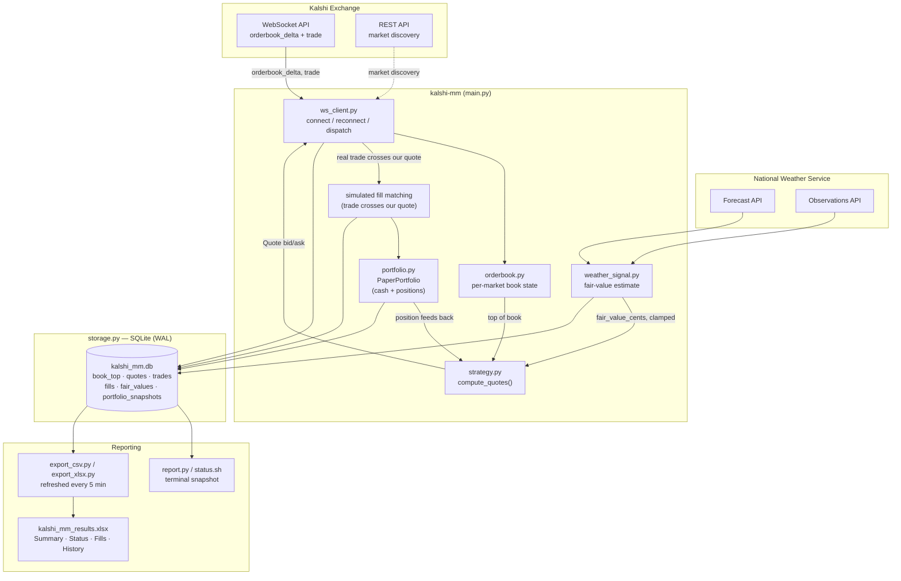

# Kalshi Market-Making

A paper-trading market-making bot for [Kalshi](https://kalshi.com) prediction markets, focused on
daily high-temperature contracts (e.g. *"Will the high in NYC be 82-83° on Aug 2?"*). It connects to
Kalshi's real market data over WebSocket, quotes a spread around either the market midpoint or its own
fair-value estimate (pulled from NWS weather data), simulates fills against real trade prints, and
tracks a simulated cash/position ledger — **no real orders are ever placed.**

> **Status: paper trading only.** Every number in this repo — fills, P&L, positions — is simulated.
> See [Honesty / limitations](#honesty--limitations) before reading too much into any of it, and
> definitely before considering real capital.

## Why market making, and why weather

Kalshi isn't a continuous market like an equity exchange — it's binary event contracts, and most
flagship markets (Fed decisions, elections) are dominated by informed flow that eats naive market
makers alive. Daily weather-threshold contracts are the opposite: high-volume, mostly retail-driven,
and boring enough that a simple strategy has a chance to learn the mechanics — order book handling,
inventory risk, adverse selection — without being immediately picked apart by someone who knows more
than you.

## Architecture



**Data flow in one sentence:** real Kalshi order book + trade data drives a local book model, which
(optionally, and clamped) blends with an independent weather-forecast fair-value estimate to produce a
quote; real trades that cross that quote are simulated as fills into a paper portfolio; everything is
logged to SQLite and surfaced via a terminal report or a periodically-refreshed Excel workbook.

## Strategy: three layers, stacked

1. **Static spread** — quote `midpoint ± half_spread_cents`. No opinion, just captures spread.
2. **Inventory skew** — shift the *entire* quote toward flattening as position grows. Short →
   become a more aggressive buyer (bid closer to market) and a more reluctant seller (ask further
   away). Long → the mirror image. At `|position| == max_position`, skew maxes out at
   `max_skew_cents`. At zero position, skew is zero and this collapses back to plain static spread.
3. **Fair-value signal (optional, off by default)** — instead of centering on the market midpoint,
   center on our own probability estimate for the temperature bucket, pulled from NWS forecast +
   live observations. **Clamped** to `max_divergence_cents` from the market midpoint no matter how
   confident (or wrong) the signal is — a broken model can nudge quotes, never send them somewhere
   absurd.

```python
skew = -(position / max_position) * max_skew_cents
center = clamp(fair_value_cents, mid ± max_divergence_cents)  # or just `mid` if no signal
quote_center = center + skew
bid = quote_center - half_spread_cents
ask = quote_center + half_spread_cents
```

Position sizing is clipped to *remaining room* under `max_position`, not just on/off — otherwise a
single large trade can blow through the cap by up to `quote_size` right as you approach it.

## Fill simulation (read this before trusting any P&L number)

There's no real order resting on Kalshi's book. A fill is simulated whenever a **real trade prints at
or through our quoted price** — i.e. "if the market traded at 42¢ and our bid was 43¢, assume we'd
have been filled." This ignores queue priority ahead of us, so it's an **optimistic upper bound** on
real fill frequency. Treat simulated P&L as validating the mechanics, not as a return forecast.

## Weather fair-value signal

For tickers like `KXHIGHNY-26AUG02-B82.5` (resolves YES iff NYC's high on Aug 2 lands in **[82, 83)**
— confirmed against Kalshi's own `rules_primary` text per market, not guessed from the ticker format):

1. Look up the exact NWS settlement station (Central Park for NYC, airport codes for the rest).
2. Pull the NWS point forecast for that day, plus recent observations (the day's high can't be lower
   than what's already been recorded).
3. Model the eventual high as `Normal(forecast, std_dev)`, where `std_dev` widens the further we are
   from a same-day forecast, *and* the more hours remain until the assumed ~3pm peak — a 5am same-day
   forecast is much less certain than a 4pm one.
4. `fair_value = CDF(upper) − CDF(lower)` for the bucket.

**This is explicitly unvalidated.** In its first live run, fair value came in below the market on all
5 tracked cities simultaneously — a systematic bias (most likely: NWS's public forecast running
cooler than what informed traders reference) rather than five independent edges. It's wired in but
currently running with `max_divergence_cents=0` (shadow mode: logs to the `fair_values` table, doesn't
touch quotes) pending validation against real settlements.

## Repo layout

| File | Responsibility |
|---|---|
| `main.py` | CLI entry point, argument parsing |
| `ws_client.py` | WebSocket connect/reconnect, message dispatch, requoting, fill simulation |
| `orderbook.py` | Per-market local order book (`OrderBook`), parses Kalshi's dollar-string wire format |
| `strategy.py` | `compute_quotes()` — spread, skew, fair-value clamp |
| `weather_signal.py` | NWS forecast/observation fetch, bucket-probability fair value |
| `portfolio.py` | `PaperPortfolio` — simulated cash & positions |
| `storage.py` | SQLite schema + inserts (WAL mode, safe to read concurrently) |
| `kalshi_auth.py` | Kalshi API key-id + RSA-PSS request signing |
| `report.py` / `status.sh` | Terminal status: book, quotes, fills, P&L |
| `export_csv.py` / `export_xlsx.py` | CSV / Excel workbook export |
| `run_bot.sh`, `export.sh` | Wrapper scripts for `launchd` |

## Running it

```bash
python3 -m venv .venv && source .venv/bin/activate
pip install -r requirements.txt

export KALSHI_API_KEY_ID="..."
export KALSHI_PRIVATE_KEY_PATH="$HOME/.config/kalshi/your-key.pem"
# KALSHI_USE_DEMO=1 points at Kalshi's sandbox instead of real market data —
# note the sandbox has near-zero simulated liquidity, so real data (still zero
# capital risk, since this tool never places orders) is more useful for testing.

python main.py \
  --market KXHIGHNY-26AUG02-B82.5 \
  --half-spread-cents 1 --quote-size 10 --max-position 50 \
  --max-skew-cents 1 --max-divergence-cents 0 --starting-cash 1000
```

Check results any time with `python report.py` or `open data/exports/kalshi_mm_results.xlsx`
(auto-refreshed every 5 min if the `launchd` export job is running).

### Running 24/7 (`launchd`, macOS)

```bash
launchctl bootstrap gui/$(id -u) ~/Library/LaunchAgents/com.kalshimm.bot.plist     # start (KeepAlive + RunAtLoad)
launchctl bootstrap gui/$(id -u) ~/Library/LaunchAgents/com.kalshimm.export.plist  # CSV/Excel refresh every 5 min
launchctl kickstart -k gui/$(id -u)/com.kalshimm.bot                              # restart after editing run_bot.sh
launchctl bootout gui/$(id -u)/com.kalshimm.bot                                   # actually stop it (kill alone just respawns it)
```

## Honesty / limitations

- **Fill model is optimistic** (see above) — real fills would be less frequent than simulated ones.
- **Weather signal is unvalidated** and currently disabled from driving quotes (shadow-logging only).
- **Markets expire daily.** These are same-day/next-day contracts; there's no automatic rollover to
  fresh tickers yet — running this unattended for more than a day or two needs that built.
- **No real order placement (OMS).** `kalshi_auth.py` currently only signs the WebSocket handshake;
  placing real orders needs the signing generalized to arbitrary REST method+path, plus a real
  cancel/replace order-management layer.
- **No risk / kill-switch layer** beyond the per-market position cap.
- **24/7 on a laptop is fragile** — lid-close or sleep pauses everything. A dedicated always-on
  machine (Mac mini, VPS) is the real target for unattended operation.

## Roadmap

1. Validate the weather signal against real settlements; fix the systematic bias before re-enabling.
2. Market rollover — auto-pick fresh contracts as today's expire.
3. Real order placement + OMS (cancel/replace reconciliation).
4. Risk layer / kill switch beyond position caps.
5. Only after all of the above: a deliberate, separate decision about real capital.
